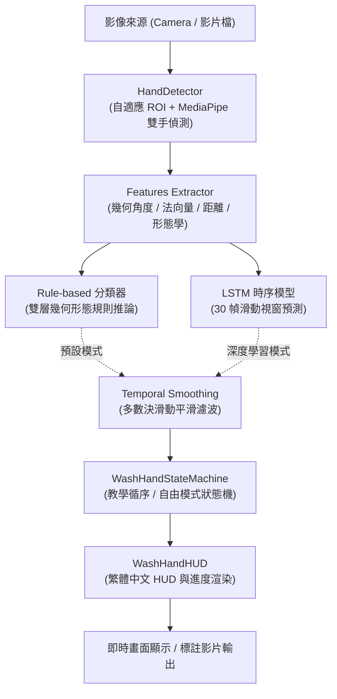
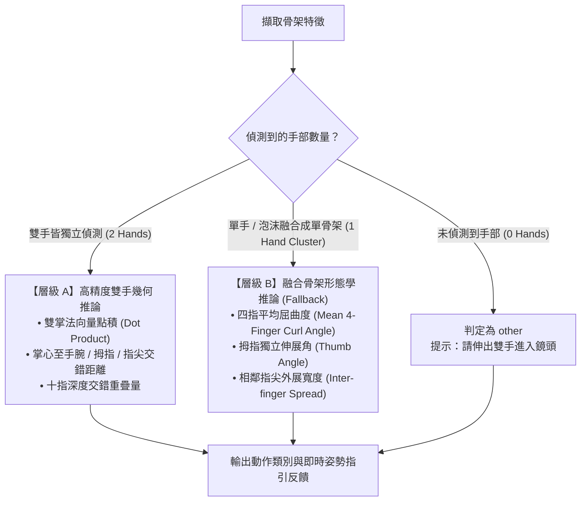

# 洗手即時辨識系統 — 專案架構與判斷模式說明文檔

本專案使用 **MediaPipe 雙手骨架追蹤 + 幾何形態學特徵工程 + 規則分類器 (Rule-based) / LSTM 時序神經網路 + 洗手狀態機 (State Machine) + 繁體中文 HUD 介面**，實現衛生福利部與 WHO 標準「**內、外、夾、弓、大、立、腕**」七步洗手動作之即時辨識、流程引導與評估計時。

---

## 📑 目錄

1. [專案模組架構](#一專案模組架構)
2. [系統資料流與推論管線](#二系統資料流與推論管線)
3. [七步洗手動作判斷模式與特徵邏輯](#三七步洗手動作判斷模式與特徵邏輯)
4. [雙手交疊與泡沫遮蔽強韌化機制](#四雙手交疊與泡沫遮蔽強韌化機制)
5. [洗手狀態機與引導模式](#五洗手狀態機與引導模式)
6. [模組詳細說明與 API 職責](#六模組詳細說明與-api-職責)

---

## 一、專案模組架構

```text
wash_hand_detect/
├── README.md                      # 專案簡介與快速上手指南
├── IMPLEMENTATION.md              # 系統技術設計規格書
├── ARCHITECTURE.md                # 專案架構與判斷模式說明（本文檔）
├── requirements.txt               # 專案相依 Python 套件清單
│
├── models/
│   └── wash_hand_lstm.keras       # 已訓練之 LSTM 30 幀時序預測模型權重
│
├── data/
│   ├── raw/                       # 原始測試影片（如 WHO 示範、Facebook 實測影片等）
│   ├── processed/                 # 受試者錄製之 30 幀特徵序列 (.npy)
│   └── labels.csv                 # 錄製樣本清單與標籤索引
│
├── src/
│   ├── __init__.py
│   ├── camera.py                  # 影像來源封裝（支援 WebCam、影片檔案與合成測試畫面）
│   ├── hand_detector.py           # MediaPipe 雙手 21 特徵點偵測、自適應 ROI 裁切與左右手校正
│   ├── features.py                # 幾何、角度、法向量、指縫深度與單手重疊形態學特徵計算
│   ├── rule_classifier.py         # 七步動作規則分類器與即時姿勢反饋生成
│   ├── state_machine.py           # 洗手狀態轉移、持續秒數計時與教學/自由模式引擎
│   ├── ui.py                      # 繁體中文 HUD 渲染器（半透明面板、進度條、七步清單）
│   ├── realtime.py                # 即時辨識主程式 Pipeline
│   ├── test_video.py              # 離線/批次影片評估與動作標註影片產出工具
│   ├── collect_data.py            # 互動式資料收集錄製工具
│   └── train.py                   # LSTM 時序模型訓練、Person-split 切分與 Confusion Matrix 評估
│
└── tests/
    └── test_pipeline.py           # 特徵計算、狀態機與分類器單元測試套件
```

---

## 二、系統資料流與推論管線



### 資料處理階段說明：
1. **輸入與自適應預處理**：支援鏡頭實時畫面與各種比例影片（如 16:9 橫向、9:16 直式短影音），若為直式/黑邊影片自動啟動自適應 ROI 聚焦，提升有效手部解析度。
2. **骨架擷取**：擷取左右手各 21 個 3D 座標點（共 42 點），並消除 MediaPipe 左右手標籤重複覆蓋問題。
3. **特徵工程**：計算 157 維特徵向量（手腕座標歸零、手掌尺度正規化、掌心法向量夾角、手指彎曲角、指尖對掌心距離、指縫交錯深度、運動速度等）。
4. **動作推論**：支援即時雙模（Rule-based 幾何推論 與 LSTM 神經網路）。
5. **時序平滑**：以長度為 10 幀的滑動視窗進行多數決濾波，消除動態模糊與短暫掉幀抖動。
6. **狀態機推進**：依據設定模式（教學/自由）累計達標秒數，並提供即時中文指引反饋。

---

## 三、七步洗手動作判斷模式與特徵邏輯

系統依據衛生福利部標準七步口訣定義 7 個核心洗手動作與 1 個「其他/未開始」類別：

| 類別代號 | 中文口訣 | 動作標準說明 | 核心特徵依據 |
| :---: | :---: | :--- | :--- |
| `0` (`other`) | **其他** | 尚未開始、伸手中、沖水、拿肥皂或姿勢非標準 | 雙手未入鏡、雙手距離過遠（$d > 2.8$）或未符合任一洗手形態 |
| `1` (`inside`) | **內** | **掌心對掌心** 相互搓揉 | 雙掌中心極近（$d < 1.4$）、掌面法向量反向對立（$\vec{n}_L \cdot \vec{n}_R < 0.2$）、四指保持伸展（關節角度 $> 155^\circ$） |
| `2` (`outside`) | **外** | **掌心搓揉另一手手背**（左右手互換） | 一手掌面貼合另一手手背、兩手法向量大致同向（$\vec{n}_L \cdot \vec{n}_R > 0.0$）、掌心距離近（$d < 1.4$） |
| `3` (`interlace`) | **夾** | **十指交錯交叉** 搓洗指縫 | 十指指縫深度交疊（`interlace_depth` $< 0.90$）、指尖外展寬度顯著增加、掌心相對 |
| `4` (`knuckles`) | **弓** | **指背扣入掌心** 搓揉指背與關節 | 四指明顯大幅屈曲扣合（平均指關節角度 $< 135^\circ \sim 140^\circ$）、指背與對側掌心緊密貼合 |
| `5` (`thumb`) | **大** | **握住大拇指** 旋轉搓揉 | 一手掌心緊密包覆另一手拇指（$d(\text{Palm}, \text{Thumb}) < 0.80$）、拇指呈特定展角（$> 140^\circ$）而四指握拳 |
| `6` (`fingertips`) | **立** | **五指指尖聚攏** 在掌心旋轉搓揉 | 五指指尖聚攏群集（`fingertips cluster` $< 0.75$）、指尖抵在對側掌心、掌心間距保持微距 |
| `7` (`wrist`) | **腕** | **雙手互握手腕** 旋轉搓洗至手腕處 | 一手掌心貼合另一手手腕關節（$d(\text{Palm}, \text{Wrist}) < 0.85$）、掌心中心間距顯著大於掌腕間距 |

---

## 四、雙手交疊與泡沫遮蔽強韌化機制

在真實洗手環境（例如雙手沾滿肥皂泡沫、高速搓洗或直式手機錄影）中，常發生雙手重疊而使 MediaPipe 只輸出 **單一副合併骨架** 的情況。系統採用 **雙層階層式判斷架構**：



* **層級 A（雙手獨立模式）**：利用雙手相對空間關係（法向量夾角、距離矩陣）進行高精度嚴格判別。
* **層級 B（單手/交疊融合降級模式）**：
  - 四指平均角度 $< 120^\circ$ 且拇指角度 $> 140^\circ$ $\rightarrow$ **大 (Thumb)**
  - 四指平均角度 $< 118^\circ$ 且指尖聚攏 $\rightarrow$ **立 (Fingertips)**
  - 四指平均角度 $< 135^\circ$ $\rightarrow$ **弓 (Knuckles)**
  - 指尖外展寬度 $> 0.35$ $\rightarrow$ **夾 (Interlace)**
  - 四指平展伸直（$> 155^\circ$） $\rightarrow$ **內 (Inside)** / **外 (Outside)**

---

## 五、洗手狀態機與引導模式

洗手狀態機 ([src/state_machine.py](file:///Users/esleyw/Desktop/wash_hand_detect/src/state_machine.py)) 負責管理洗手階段的推進、時間累計與結算：

### 1. 教學循序模式 (`sequence`)
* **流程**：強制依「**內 $\rightarrow$ 外 $\rightarrow$ 夾 $\rightarrow$ 弓 $\rightarrow$ 大 $\rightarrow$ 立 $\rightarrow$ 腕**」固定順序推進。
* **判定機制**：只有目前目標步驟動作正確且持續達標（預設每步 2.5 秒），才會進入下一個步驟。
* **適用場景**：衛教教學、標準流程訓練、考評評分。

### 2. 自由搓洗模式 (`free`)
* **流程**：使用者可依個人習慣任意順序搓揉。
* **判定機制**：系統即時辨識當前動作，並獨立累積 7 個步驟各自的有效搓洗時間，個別累計滿指定秒數（如 1.0~2.5 秒）即標記為完成；7 步全數完成時觸發結算通關。
* **適用場景**：日常自主洗手監測、快速檢測。

### 3. 短暫遮蔽容錯機制 (Grace Decay)
* 若洗手動作因泡沫遮蔽或換手瞬間產生 1~3 幀的短暫抖動，狀態機具備容錯緩衝時間（預設 0.35 秒），不會瞬間清空進度，避免使用者體驗中斷。

---

## 六、模組詳細說明與 API 職責

| 模組檔案 | 核心類別 / 函式 | 職責與關鍵功能說明 |
| :--- | :--- | :--- |
| [src/camera.py](file:///Users/esleyw/Desktop/wash_hand_detect/src/camera.py) | `Camera` | 視訊輸入介面封裝，支援 WebCam (Index)、影片檔案 (.mp4/.webm) 與 `synthetic` 合成畫布；影片播放結束自動循環。 |
| [src/hand_detector.py](file:///Users/esleyw/Desktop/wash_hand_detect/src/hand_detector.py) | `HandDetector` | 封裝 MediaPipe Hands，具備自適應 ROI 裁切、左右手標籤重複自動修正與骨架繪製功能。 |
| [src/features.py](file:///Users/esleyw/Desktop/wash_hand_detect/src/features.py) | `extract_hand_features`, `feature_dict_to_vector` | 骨架座標正規化、幾何特徵計算、空間距離量測與 157 維特徵向量轉換。 |
| [src/rule_classifier.py](file:///Users/esleyw/Desktop/wash_hand_detect/src/rule_classifier.py) | `WashHandRuleClassifier` | 雙層洗手規則分類器，輸出即時動作名稱、信心度評分與繁體中文姿勢指引提示。 |
| [src/state_machine.py](file:///Users/esleyw/Desktop/wash_hand_detect/src/state_machine.py) | `WashHandStateMachine` | 管理 Sequence 與 Free 模式之狀態轉移、秒數累計、進度摘要與完成結算。 |
| [src/ui.py](file:///Users/esleyw/Desktop/wash_hand_detect/src/ui.py) | `WashHandHUD` | 現代化半透明玻璃風 HUD、繁體中文動態狀態、信心度長條圖、七步清單與完成慶祝畫面。 |
| [src/realtime.py](file:///Users/esleyw/Desktop/wash_hand_detect/src/realtime.py) | `RealtimeWashHandDetector` | 即時應用程式主入口，整合影像擷取、特徵提取、分類預測、平滑濾波、狀態機與 HUD 渲染。 |
| [src/test_video.py](file:///Users/esleyw/Desktop/wash_hand_detect/src/test_video.py) | `evaluate_video` | 離線影片批次評估工具，統計各動作辨識率與完成狀態，並可輸出骨架標註影片。 |
| [src/train.py](file:///Users/esleyw/Desktop/wash_hand_detect/src/train.py) | `build_lstm_model`, `train_model` | 建立 2 層雙向 LSTM/GRU 時序網路（30 幀窗口），依受試者切分資料並評估 F1-Score。 |
| [tests/test_pipeline.py](file:///Users/esleyw/Desktop/wash_hand_detect/tests/test_pipeline.py) | `pytest` 測試用例 | 包含特徵提取正規化、狀態機進程、規則分類器與神經網路整合測試。 |

---

## 🚀 七、快速常用命令

```bash
# 1. 啟用環境
source venv/bin/activate

# 2. 啟動即時鏡頭洗手辨識 (教學模式)
python -m src.realtime

# 3. 自由洗手模式 + 指定測試影片
python -m src.realtime --source data/raw/fb_video_1.mp4 --guide-mode free

# 4. 執行離線評估並產出標註影片
python -m src.test_video --video data/raw/fb_video_1.mp4 --output data/raw/output_annotated.mp4

# 5. 執行自動化測試套件
PYTHONPATH=. pytest tests/
```
