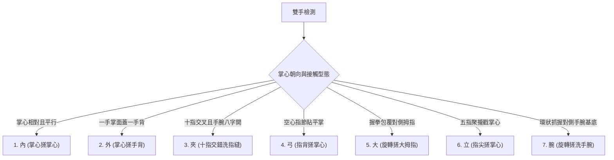

# 完整七步洗手辨識系統：白話判斷邏輯與決策機制說明書

本文檔以最白話、易懂的方式，全面解析目前系統的判斷架構、時間窗口（幾幀為一個判斷）、以及七個洗手動作的具體特徵規則。

---

## 一、系統核心決策架構：幾幀為一個判斷？

很多人以為 AI 辨識是「拍一張照片就直接做一個判斷」，但在實際洗手情境中，畫面會有水花、肥皂泡沫、鏡頭反光，而且手在快速移動時可能會有殘影。如果完全單靠「單一幀（Frame）」來決定，畫面上的文字與提示燈就會瘋狂閃爍跳動。

因此，系統採用了 **「單幀幾何即時打分 + 時間滑動窗口綜合決策」** 的兩層架構：

```mermaid
flowchart LR
    A[每秒 30 幀影像] --> B[MediaPipe 骨架擷取]
    B --> C[每幀獨立幾何特徵計算]
    C --> D[純規則分類器打分 (Raw Score)]
    D --> E[時間滑動窗口 (Temporal Accumulator)]
    E --> F[最終穩定輸出 (HUD 動作提示)]
```

### 1. 單幀打分（每 1 幀分析一次）
* **頻率**：以攝影機的幀率運行（通常為 **每秒 24 ~ 30 幀**，即每 0.033 秒分析一次）。
* **任務**：計算雙手的 21 個 3D 骨架關節點，分析手指彎曲度、掌心朝向、指尖深入深度、大拇指方向等 160 維幾何特徵，並產出當前這一幀各動作的原始機率（Raw Score）。

### 2. 時間滑動窗口決策（幾幀決定一次最終動作？）
* **窗口時間長度**：預設為 **0.5 秒（約 15 幀）**，亦可在設定中指定為 **1.0 秒（約 30 幀）**。
* **白話理解**：
  * 系統背後有一條「傳送帶」，永遠裝著「最近 15 幀（或 30 幀）」的判斷結果。
  * 每一來一幀新畫面，最舊的一幀就會被移出傳送帶。
  * 系統會統計這條傳送帶中，各個動作所累積的加權機率。
* **防誤判三道門檻（只有達標才會切換動作）**：
  1. **優勢差距（Margin >= 0.12）**：第一名的動作累積機率，必須領先第二名至少 **12% 以上**。如果兩個動作勢均力敵（例如夾 30%、外 28%），系統會認為動作不夠明確，主動退回顯示 **【其他（動作待確認）】**。
  2. **連續幀確認（Consecutive >= 2 幀）**：新動作必須至少連續 2 幀保持最高，防止單幀雜訊閃爍。
  3. **最低信心門檻（Confidence Threshold）**：綜合分數需達到基本閾值，才算有效完成度累積。

---

## 二、七步洗手動作白話判斷邏輯（內、外、夾、弓、大、立、腕）

系統依據衛生福利部與 WHO 標準「內外夾弓大立腕」洗手七步驟進行幾何規則裁決：



---

### 1. 【內】掌心搓掌心
* **白話特徵**：就像「雙手擊掌合十」一樣，掌面緊貼，雙手平行對搓。
* **具體幾何判斷**：
  * **掌面相對**：左手掌心法向量與右手掌心相反（`palm_dot < -0.25`）。
  * **兩手平行**：兩手手腕到中指的軸向角度極小（夾角 `axis_angle < 15°`，通常只有 0°～10°）。
  * **大拇指同側**：雙掌合攏時，兩手的大拇指指向同一個方向（`thumbs_same_side`）。
  * **無交叉指縫**：手指平貼在對方指面上，沒有插入對方指縫中。

---

### 2. 【外】掌心搓洗手背
* **白話特徵**：一隻手像「蓋棉被」一樣覆蓋在另一隻手的手背上前後滑動，且雙手通常輪流換手。
* **具體幾何判斷**：
  * **手背接觸與深度不對稱**：上方手的指尖貼在下方手手背上，但下方手的掌心露在外面，雙手指尖深入深淺極度不對稱（`depth_asym > 0.25`）。
  * **掌心覆蓋手背**：上方手的掌心面與下方手的手背朝同方向（`palm_dot > 0.20` 或手背接觸追蹤器有得分）。
  * **大拇指異邊**：雙手上下重疊時，兩手的大拇指一個在左、一個在右，朝向相反。
  * **運動不對稱（一動一靜）**：上方手在手背上滑動搓洗，下方手相對平穩充當支撐。
  * **夾防禦盾排除**：若手指有穿插進指縫，則不可判為外。

---

### 3. 【夾】十指交錯洗指縫
* **白話特徵**：雙手像「拉鍊齒」或「梳子齒」一樣，十指緊扣交叉，手指深深卡進對方的指縫間搓洗。
* **具體幾何判斷**：
  * **手指交替排列**：從正上方二維投影看，手指呈現「左、右、左、右、左、右」的交錯排列（交替次數 `interlace_alts >= 2`）。
  * **指尖深入指根**：十指緊扣時，指尖都深入到對側手指根部附近（`interlace_depth < 1.05`）。
  * **手腕八字 X 交叉**：手腕分開，雙手骨架呈 X 型角度交叉（`axis_angle > 18°`）。
  * **掌心面對面相向**：洗指縫時掌心是互相朝向對方的（`palm_dot <= 0.15`）。
  * **夾防禦盾（Clamp Guard）保護**：只要滿足上述交錯與交叉特徵，系統會主動啟動防禦盾，給予夾大量加分，並強力壓制「外」，避免被誤判成手背搓洗。

---

### 4. 【弓】指背搓掌心
* **白話特徵**：一隻手握成「空心半拳（弓形）」，將手指背部的指節貼在另一手攤平的掌心上旋轉搓洗。
* **具體幾何判斷**：
  * **一曲一平**：一隻手四指彎曲呈弓形（平均彎曲角度 90°～130°），另一隻手平展（角度 > 140°）。
  * **指節貼掌**：彎曲手的第一指節（PIP）緊貼平展手掌心中央，且指節比指尖更深貼掌心。
  * **拇指外露未被包**：平展手的大拇指懸空在外面，沒有被對側手握住（排除大拇指步驟）。

---

### 5. 【大】旋轉搓洗大拇指
* **白話特徵**：一隻手握成拳頭，將另一手豎立的大拇指「整根包在拳心裡」旋轉搓洗。
* **具體幾何判斷**：
  * **拇指深插拳心/虎口**：被搓手的大拇指尖端深深進入包覆手的掌心或虎口中（距離 < 0.65）。
  * **包覆手握拳**：包覆手的四指深彎呈抓握狀（`min_curl < 120°`）。
  * **排除手背覆蓋**：若呈現手背覆蓋特徵，則抑制大拇指判定，避免換手搓手背時誤觸發。

---

### 6. 【立】指尖搓掌心
* **白話特徵**：一隻手的五根手指尖「聚合成一束（像拿鉛筆一樣）」，直立戳在另一手攤開的掌心上旋轉搓洗。
* **具體幾何判斷**：
  * **指尖聚合成束**：四根手指尖之間的間距極小，緊密聚攏（`spread < 0.35`）。
  * **指尖深於指節**：指尖是整隻手最靠近對側掌心的部位（指尖深入距離 < 指節距離）。
  * **掌心平坦承接**：下方手攤平掌心，承接指尖的旋轉摩擦。

---

### 7. 【腕】旋轉搓洗手腕
* **白話特徵**：一隻手握成環狀，緊緊抓握在另一隻手的「手腕骨關節基部」旋轉搓洗。
* **具體幾何判斷**：
  * **深環狀抓握**：抓握手的四指深彎（`min_curl < 125°`），且拇指尖貼近食指形成閉合環狀。
  * **位置鎖定在手腕**：手掌抓握的位置明確位於對側手腕基底（Landmark 0），而非掌心或手指。

---

## 三、常見問題與邊界情況處理機制

### Q1：換手（左右手交替）時會發生什麼事？
* 剛換手的前 1～2 幀，手部骨架在空間中翻轉，速度與相對位置瞬間重置。
* 系統設有**抑制門檻與防漂移機制**，在手翻轉的 0.1 秒過渡期內暫不跳入錯誤動作，當新的一側穩定就位後，滑動窗口會在 0.2～0.3 秒內迅速累積並顯示該動作。

### Q2：肥皂泡把其中一隻手完全蓋住（只偵測到 1 隻手）怎麼辦？
* 系統內建 **Held Hand Coordinates（坐標暫存與記憶延續）** 機制：
  * 當下方手因泡沫或遮擋短暫遺失追蹤時，系統會暫存最後已知的對偶交互坐標最多 4 幀。
  * 配合單手回退模式（Single-Hand Fallback），根據上方可見手的手型特徵維持候選狀態，避免因單幀手部遺失而直接中斷進度。

### Q3：為什麼動作做對了，畫面卻顯示「其他」？
* 當雙方動作處於轉換期，或者兩手手指插在一起但掌心角度拉鋸時，各動作的分數差距小於 12%（Margin < 0.12）。
* 系統為了保證醫療衛生的洗手確實性，寧可短暫提示「其他 / 動作待確認」，也不會隨意給出錯誤的步驟計時。一旦姿勢完全到位，HUD 就會立刻亮起對應的步驟黃燈並開始計時。
